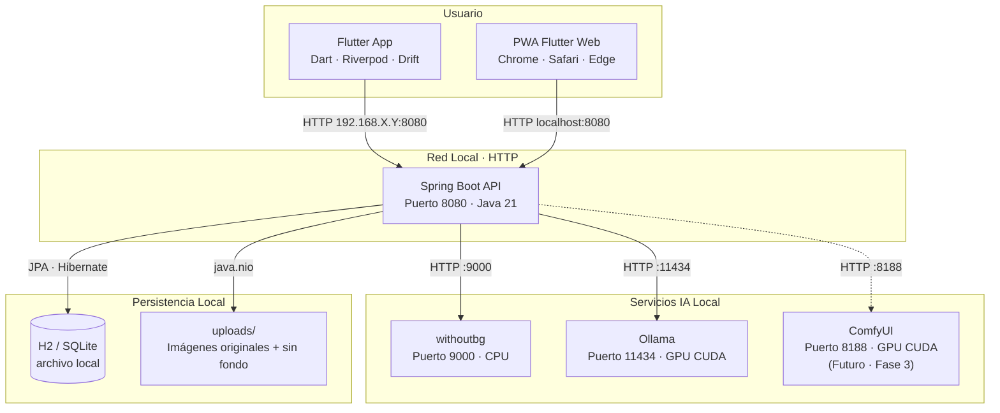
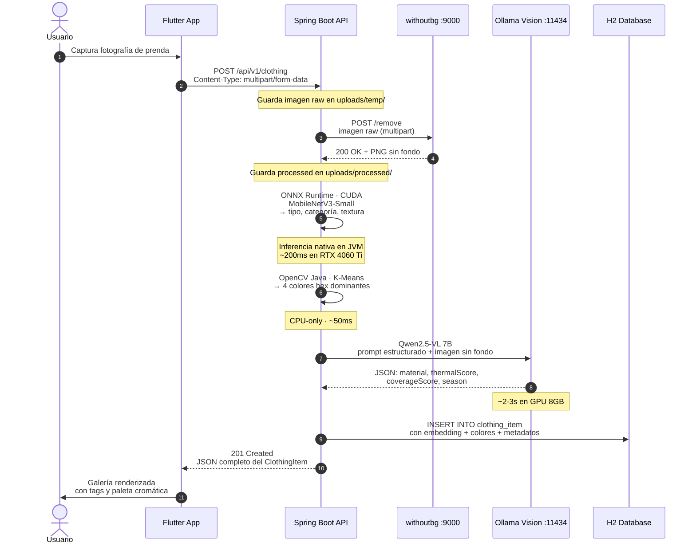
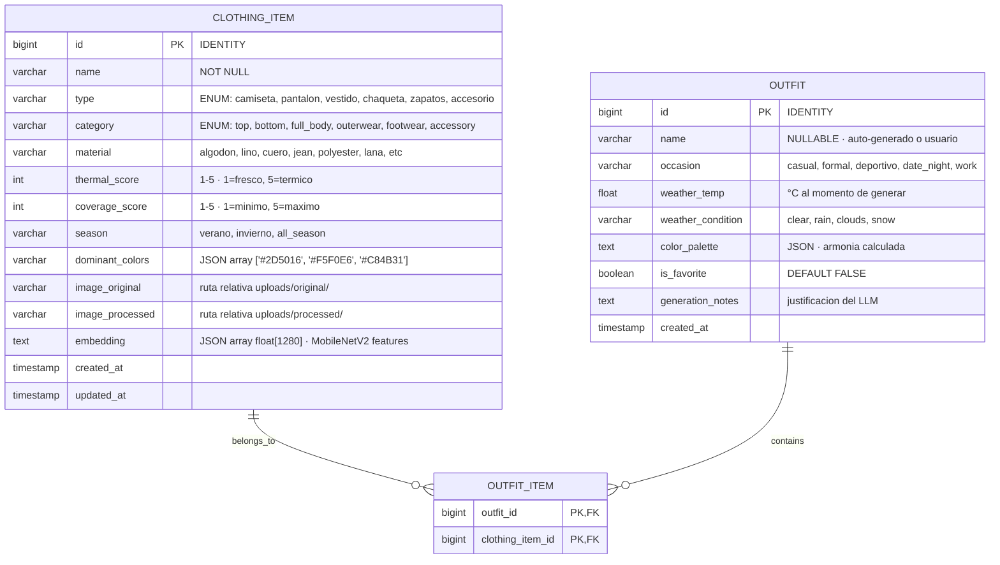

<div align="center">

# <ruby>OFNI-MAKER<rt>おふに・めーかー</rt></ruby>

**_Closet Virtual · Local-First · Inteligencia Artificial sin Nubes_**
<br>


</div>

---

## About

**OFNI-Maker** es un closet virtual con clasificación de prendas, extracción de paletas cromáticas, puntuación térmica y generación de outfits basada en el clima real de tu ciudad.

El nombre juega con la lectura inversa de *INFO* — porque este proyecto invierte la narrativa: en lugar de que la moda te consuma, tú le das forma a tu guardarropa con intención, espacio y claridad.

---

## Arquitectura



---

## Flujo de Datos: Subida de Prenda



---

## Esquema de Base de Datos



---

## Stack Tecnológico

| Capa | Herramienta | Versión | Rol en OFNI |
|:---|:---|:---|:---|
| **Backend** | Spring Boot | `3.4.x` | API REST, orquestación, inyección de dependencias |
| | Java | `21` | LTS, Virtual Threads para concurrencia de IA |
| | Spring AI | `1.0.0-M6+` | Abstracción LLM local via OllamaChatClient |
| | Spring Data JPA | `3.4.x` | Persistencia H2/SQLite sin configuración externa |
| | ONNX Runtime Java | `1.19.x` | Inferencia GPU/CPU de modelos vision dentro de la JVM |
| | JavaCV / OpenCV | `4.9.x` | K-Means clustering para extracción de colores dominantes |
| | Apache Commons Math | `3.6.x` | Algoritmo genético para optimización de outfits |
| **IA Local** | Ollama | `latest` | Motor de inferencia local LLM + Vision |
| | Qwen2.5-VL | `7B` | Clasificación visual profunda: material, estilo, textura |
| | Mistral Small 3.1 | `24B` | Razonamiento de outfits, justificación estética |
| | withoutbg | `app:latest` | Eliminación de fondo de prendas vía Docker |
| | ComfyUI | `latest` *(Fase 3)* | Stable Diffusion + IP-Adapter para virtual try-on |
| **Frontend** | Flutter | `3.29.x` | UI única para Android, iOS, Web PWA, Desktop |
| | Dart | `3.6+` | Lenguaje tipado, compilación AOT nativa |
| | Riverpod | `2.x` | Gestión de estado reactiva y cacheo local |
| | Dio | `5.x` | Cliente HTTP con interceptores, retry, multipart |
| | Drift | `2.x` | SQLite local para modo offline-first en móvil |
| | image_picker | `latest` | Captura de cámara y selección de galería |
| **Infra** | Docker Engine | `25.x+` | Contenerización de servicios auxiliares |
| | Docker Compose | `2.24+` | Orquestación multi-servicio local |
| | NVIDIA Container Toolkit | `latest` | Passthrough GPU CUDA a contenedores |

---

## Estructura del Monorepo

```
ofni-maker/
├── .github/                          # Templates, CI/CD futuro
│   └── ISSUE_TEMPLATE/
├── ai-models/                        # Python · SOLO entrenamiento/export
│   ├── training/
│   │   ├── clothing_classifier/
│   │   │   ├── train_mobilenetv3.py       # Fine-tuning con DeepFashion2
│   │   │   ├── dataset_loader.py
│   │   │   └── config.yaml
│   │   └── export_to_onnx.py              # torch.onnx.export()
│   └── notebooks/
│       ├── color_extraction_analysis.ipynb
│       └── outfit_similarity_embeddings.ipynb
│
├── backend/                          # Spring Boot · API Principal
│   ├── src/main/java/com/ofni/
│   │   ├── OfniMakerApplication.java
│   │   ├── config/
│   │   │   ├── WebConfig.java              # CORS para red local
│   │   │   ├── OnnxConfig.java             # Bean: OrtEnvironment + CUDA
│   │   │   ├── OllamaConfig.java           # Bean: ChatClient + ImageModel
│   │   │   └── OpenMeteoConfig.java        # RestTemplate bean
│   │   ├── controller/
│   │   │   ├── ClothingController.java     # CRUD prendas + upload
│   │   │   ├── OutfitController.java       # Generación + favoritos
│   │   │   └── WeatherController.java      # Proxy Open-Meteo
│   │   ├── service/
│   │   │   ├── ClothingService.java        # Orquesta: bg removal + ONNX + KMeans + LLM
│   │   │   ├── ColorService.java           # K-Means con OpenCV
│   │   │   ├── ClassificationService.java  # ONNX MobileNetV3 inference
│   │   │   ├── OutfitGenerationService.java # Embeddings + AG + LLM
│   │   │   ├── WeatherService.java         # Client Open-Meteo
│   │   │   └── StorageService.java         # java.nio.file storage
│   │   ├── model/
│   │   │   ├── ClothingItem.java
│   │   │   ├── Outfit.java
│   │   │   ├── OutfitItem.java
│   │   │   └── ColorPalette.java
│   │   ├── repository/
│   │   │   ├── ClothingItemRepository.java
│   │   │   └── OutfitRepository.java
│   │   ├── dto/
│   │   │   ├── ClothingUploadRequest.java
│   │   │   ├── ClothingResponse.java
│   │   │   ├── OutfitGenerateRequest.java
│   │   │   └── OutfitResponse.java
│   │   ├── inference/
│   │   │   ├── OnnxClothingClassifier.java    # Sesión ONNX + preprocess
│   │   │   └── ImagePreprocessor.java           # Resize 224x224 + Normalize
│   │   └── exception/
│   │       └── GlobalExceptionHandler.java
│   ├── src/main/resources/
│   │   ├── application.yml
│   │   ├── application-local.yml
│   │   └── models/
│   │       └── mobilenetv3_clothing.onnx        # Modelo exportado
│   ├── src/test/
│   ├── Dockerfile
│   ├── pom.xml
│   └── .dockerignore
│
├── frontend/                         # Flutter · Cliente universal
│   ├── lib/
│   │   ├── main.dart
│   │   ├── config/
│   │   │   ├── api_config.dart              # BaseURL según platform
│   │   │   └── theme.dart                   # Tema minimalista japonés
│   │   ├── models/
│   │   │   ├── clothing_item.dart           # Copy de entidad Java
│   │   │   ├── outfit.dart
│   │   │   └── color_palette.dart
│   │   ├── services/
│   │   │   ├── api_client.dart              # Dio + interceptores
│   │   │   ├── clothing_service.dart
│   │   │   └── outfit_service.dart
│   │   ├── providers/
│   │   │   ├── clothing_provider.dart       # Riverpod StateNotifier
│   │   │   └── outfit_provider.dart
│   │   ├── screens/
│   │   │   ├── home_screen.dart
│   │   │   ├── wardrobe_screen.dart         # Galería con paletas
│   │   │   ├── clothing_detail_screen.dart
│   │   │   ├── upload_screen.dart           # Cámara + preview
│   │   │   ├── outfit_generator_screen.dart # Clima + selector
│   │   │   └── outfit_detail_screen.dart
│   │   ├── widgets/
│   │   │   ├── clothing_card.dart           # Tarjeta con hex colors
│   │   │   ├── color_pill.dart              # Pastilla de color dominante
│   │   │   ├── thermal_badge.dart           # Score 1-5 visual
│   │   │   ├── outfit_composition.dart      # Layout de outfit armado
│   │   │   └── zen_app_bar.dart             # AppBar minimalista
│   │   └── utils/
│   │       ├── constants.dart
│   │       └── color_utils.dart             # Conversión hex/rgb/hsv
│   ├── assets/
│   │   ├── fonts/
│   │   │   └── NotoSansJP/                # Tipografía japonesa
│   │   └── images/
│   │       └── logo_ofni.png
│   ├── test/
│   ├── pubspec.yaml
│   ├── analysis_options.yaml
│   └── web/
│       ├── index.html
│       ├── manifest.json                    # PWA config
│       └── icons/
│
├── uploads/                          # Volúmen local (gitignored)
│   ├── original/                     # Fotos crudos del usuario
│   └── processed/                    # PNG sin fondo
│
├── docker-compose.yml                # Orquestación completa
├── .env.example                    # Variables de entorno template
├── .gitignore
└── README.md                         # Este documento
```

---

## Inicio Rápido

### Prerrequisitos

- **OS:** Linux (Arch/CachyOS recomendado), Windows 11, o macOS
- **GPU:** NVIDIA con 8GB+ VRAM (RTX 4060 Ti ideal)
- **RAM:** 16GB mínimo, 32GB recomendado
- **Docker:** `25.x+` con Docker Compose y NVIDIA Container Toolkit
- **Java:** OpenJDK 21 (`sudo pacman -S jdk21-openjdk`)
- **Flutter:** `3.29.x` ([guía oficial](https://docs.flutter.dev/install))

### 1. Clonar y levantar infraestructura

```bash
git clone https://github.com/tu-usuario/ofni-maker.git
cd ofni-maker

# Copiar variables de entorno
cp .env.example .env

# Levantar servicios de IA (primera vez descarga modelos)
docker compose up -d withoutbg ollama

# Descargar modelos de visión y texto en Ollama
docker exec -it ofni-maker-ollama-1 ollama pull qwen2.5-vl:7b
docker exec -it ofni-maker-ollama-1 ollama pull mistral-small:24b
```

### 2. Backend Spring Boot

```bash
cd backend

# Compilar y ejecutar con perfil local
./mvnw spring-boot:run -Dspring-boot.run.profiles=local

# O con Gradle:
# ./gradlew bootRun --args='--spring.profiles.active=local'
```

El API estará disponible en `http://localhost:8080`.

### 3. Frontend Flutter (Web para desarrollo)

```bash
cd frontend
flutter pub get
flutter run -d chrome --web-port 8081
```

Para desarrollo móvil, conecta tu teléfono por USB o usa el emulador:
```bash
flutter run
```

### 4. Verificación completa

```bash
curl -X POST http://localhost:8080/api/v1/clothing \
  -F "image=@/ruta/a/tu/camiseta.jpg" \
  -F "name=Camiseta Básica"
```

Respuesta esperada (`201 Created`):
```json
{
  "id": 1,
  "name": "Camiseta Básica",
  "type": "camiseta_manga_corta",
  "category": "top",
  "material": "algodon",
  "thermalScore": 2,
  "coverageScore": 3,
  "season": "verano",
  "dominantColors": ["#1E3A8A", "#F5F0E6"],
  "imageProcessed": "/uploads/processed/1_bgremoved.png",
  "createdAt": "2026-04-28T17:41:00Z"
}
```

---

## 🗺️ 路 · Docker Compose Completo

```yaml
# docker-compose.yml
services:
  ofni-api:
    build:
      context: ./backend
      dockerfile: Dockerfile
    container_name: ofni-api
    ports:
      - "8080:8080"
    volumes:
      - ./uploads:/app/uploads
      - ./backend/src/main/resources/models:/app/models:ro
    environment:
      - SPRING_PROFILES_ACTIVE=local
      - OFNI_STORAGE_PATH=/app/uploads
      - OFNI_WITHOUTBG_URL=http://withoutbg:9000
      - OFNI_OLLAMA_URL=http://ollama:11434
      - OFNI_OLLAMA_VISION_MODEL=qwen2.5-vl:7b
      - OFNI_OLLAMA_TEXT_MODEL=mistral-small:24b
      - OFNI_ONNX_MODEL_PATH=/app/models/mobilenetv3_clothing.onnx
      - OFNI_ONNX_USE_CUDA=true
    depends_on:
      - withoutbg
      - ollama
    networks:
      - ofni-network

  withoutbg:
    image: withoutbg/app:latest
    container_name: ofni-withoutbg
    ports:
      - "9000:9000"
    environment:
      - WITHOUTBG_PORT=9000
      - WITHOUTBG_HOST=0.0.0.0
    networks:
      - ofni-network

  ollama:
    image: ollama/ollama:latest
    container_name: ofni-ollama
    ports:
      - "11434:11434"
    volumes:
      - ollama-models:/root/.ollama
    deploy:
      resources:
        reservations:
          devices:
            - driver: nvidia
              count: 1
              capabilities: [gpu]
    networks:
      - ofni-network

  # Descomentar en Fase 3 (Virtual Try-On)
  # comfyui:
  #   image: yanwk/comfyui-boot:latest
  #   container_name: ofni-comfyui
  #   ports:
  #     - "8188:8188"
  #   volumes:
  #     - ./comfyui-workflows:/app/user_data/workflows
  #     - comfyui-models:/app/models
  #   deploy:
  #     resources:
  #       reservations:
  #         devices:
  #           - driver: nvidia
  #             count: 1
  #             capabilities: [gpu]
  #   networks:
  #     - ofni-network

volumes:
  ollama-models:
    driver: local
  # comfyui-models:
  #   driver: local

networks:
  ofni-network:
    driver: bridge
```

---

## Fases del Camino

```mermaid
graph LR
    subgraph Phase1 ["一期 · Haru · Primavera"]
        direction TB
        P1A["Closet Virtual Base"]
        P1B["Upload + BG Removal"]
        P1C["ONNX Classification"]
        P1D["K-Means Colors"]
    end

    subgraph Phase2 ["二期 · Natsu · Verano"]
        direction TB
        P2A["Open-Meteo Integration"]
        P2B["Outfit Engine v1"]
        P2C["Color Theory + AG"]
        P2D["Flutter PWA Release"]
    end

    subgraph Phase3 ["三期 · Aki · Otoño"]
        direction TB
        P3A["ComfyUI Try-On"]
        P3B["IP-Adapter Workflow"]
        P3C["Mobile Apps Stores"]
    end

    Phase1 -->|~3 semanas| Phase2
    Phase2 -->|~4 semanas| Phase3

    style Phase1 fill:#F5F0E6,stroke:#2D5016,stroke-width:2px
    style Phase2 fill:#F5F0E6,stroke:#C84B31,stroke-width:2px
    style Phase3 fill:#F5F0E6,stroke:#9B8B7A,stroke-width:2px
```



| Fase | Objetivo | Tecnologías Dominantes | Métrica de Éxito |
|:---|:---|:---|:---|
| **Haru** | Tener un closet funcional donde subir una foto y verla clasificada con colores | Flutter, Spring Boot, withoutbg, ONNX, OpenCV | Subir 5 prendas, todas clasificadas correctamente |
| **Natsu** | Generar outfits automáticos que respeten clima, color y estilo | Ollama LLM, embeddings, algoritmo genético, Open-Meteo | 3 outfits generados, al menos 1 usable realmente |
| **Aki** | Ver cómo te queda el outfit antes de vestirte | ComfyUI, Stable Diffusion 1.5 Turbo, IP-Adapter | Imagen generada en <30s que se parece a la combinación |

---

## Convenciones

1. **Java:** Arquitectura hexagonal dentro de Spring. `model/` es dominio puro. `service/` es orquestación. `inference/` es infraestructura. Nunca mezcles ONNX en un Controller.
2. **Flutter:** Un provider por screen. Los `services/` solo hacen HTTP, nunca lógica de presentación. Los modelos Dart deben tener `fromJson`/`toJson` idénticos a los DTOs Java.
3. **AI Pipeline:** El flujo siempre es: *Imagen → withoutbg → ONNX (tipado) → OpenCV (colores) → Ollama Vision (contexto) → DB*. Nunca saltes pasos.
4. **Docker:** Nunca commitees `uploads/` ni volúmenes de modelos. El `docker-compose.yml` debe poder levantarse con `docker compose up` desde cero en una máquina nueva con GPU.

---

<div align="center">

<br>

*Hecho con intención, espacio y paciencia.*

**OFNI-Maker**

<br>

</div>