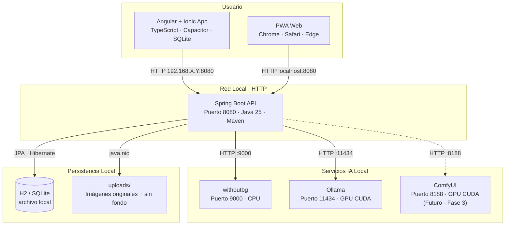
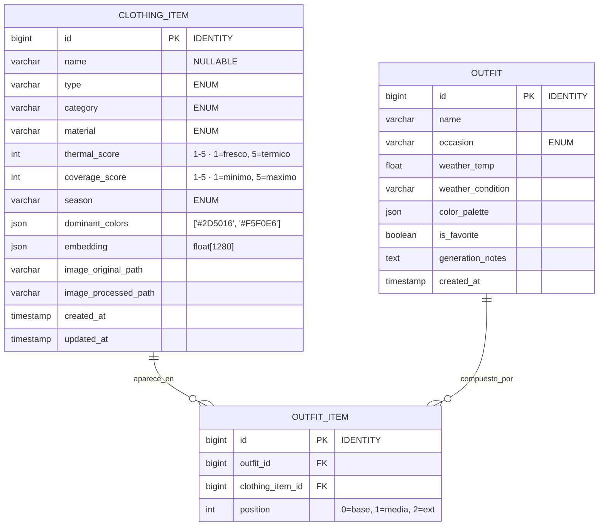

<div align="center">

# <ruby>OFNI-MAKER<rt>おふに・めーかー</rt></ruby>

**_Closet Virtual · Local-First · Inteligencia Artificial sin Nubes_**

<br>


</div>

---

## About

**OFNI-Maker** es un closet virtual con clasificación automática de prendas, extracción de paletas cromáticas, puntuación térmica y generación de outfits basada en el clima real de tu ciudad.

El nombre juega con la lectura inversa de *INFO* — porque este proyecto invierte la narrativa: en lugar de que la moda te consuma, tú le das forma a tu guardarropa con intención, espacio y claridad.

---

## Arquitectura



---

## Flujo de Datos: Subida de Prenda


---

## Esquema de Base de Datos



---

## Stack Tecnológico

| Capa | Tecnología | Versión | Rol en OFNI |
|:---|:---|:---|:---|
| **Frontend** | Angular | `19.x` | UI declarativa, componentes reutilizables |
| | Ionic Framework | `8.x` | Componentes móviles nativos, navegación, overlays |
| | Capacitor | `6.x` | Bridge nativo: cámara, galería, filesystem, SQLite |
| | TypeScript | `5.6+` | Tipado estático en todo el cliente |
| | Tailwind CSS | `4.x` | Estilos utility-first, paleta OFNI custom |
| | TanStack Query | `5.x` | Cacheo server-state, sincronización offline |
| | Zustand | `4.x` | Estado global ligero |
| **Backend** | Spring Boot | `4.0.x` | API REST, orquestación, virtual threads |
| | Java | `25` | Virtual threads, records, pattern matching |
| | Maven | `3.9.x` | Build, gestión de dependencias |
| | Spring AI | `1.0.0-M6` | Abstracción LLM local (Ollama) |
| | Spring Data JPA | `4.0.x` | Persistencia H2/SQLite |
| | ONNX Runtime Java GPU | `1.19.x` | Inferencia MobileNetV4 en GPU dentro de la JVM |
| | JavaCV / OpenCV | `1.5.10` | K-Means clustering extracción de colores |
| **IA Local** | Ollama | `latest` | Motor inferencia local LLM + Vision |
| | Qwen2.5-VL | `7B` | Clasificación visual profunda |
| | Mistral Small | `24B` | Razonamiento outfits, justificación estética |
| | withoutbg | `app:latest` | Eliminación fondo vía Docker |
| | ComfyUI | `latest` *(Fase 3)* | Virtual try-on Stable Diffusion + IP-Adapter |
| **ML Training** | Python · uv | `3.12+` | Entrenamiento MobileNetV4, export ONNX |
| | timm | `latest` | Backbones pre-entrenados, fine-tuning |
| | PyTorch | `2.4+` | Framework entrenamiento |
| **Infra** | Docker Engine | `25.x+` | Contenerización servicios auxiliares |
| | Docker Compose | `2.24+` | Orquestación multi-servicio local |
| | NVIDIA Container Toolkit | `latest` | Passthrough GPU CUDA a contenedores |

---

## Estructura del Monorepo

```
ofni-maker/
├── ai-models/                          # Python · SOLO entrenamiento/export
│   ├── training/
│   │   ├── clothing_classifier/
│   │   │   ├── train_mobilenetv4.py       # Fine-tuning con DeepFashion2
│   │   │   ├── dataset_loader.py
│   │   │   └── config.yaml
│   │   └── export_to_onnx.py              # torch.onnx.export()
│   ├── notebooks/
│   │   └── color_extraction_analysis.ipynb
│   ├── data/                              # Datasets locales (gitignored)
│   ├── checkpoints/                       # Pesos intermedios (gitignored)
│   ├── pyproject.toml                     # uv deps: torch, timm, opencv-python
│   ├── uv.lock
│   └── .venv/
│
├── backend/                              # Spring Boot · API Principal · Maven
│   ├── src/main/java/com/ofni/
│   │   ├── OfniMakerApplication.java
│   │   ├── config/
│   │   │   ├── WebConfig.java              # CORS red local
│   │   │   ├── OnnxConfig.java             # OrtEnvironment + CUDA provider
│   │   │   ├── OllamaConfig.java           # ChatClient + ImageModel
│   │   │   └── OpenMeteoConfig.java        # RestClient proxy clima
│   │   ├── controller/
│   │   │   ├── ClothingController.java     # CRUD + upload multipart
│   │   │   ├── OutfitController.java       # Generación + favoritos
│   │   │   └── WeatherController.java      # Proxy Open-Meteo
│   │   ├── service/
│   │   │   ├── ClothingService.java        # Orquesta pipeline completa
│   │   │   ├── ColorService.java           # K-Means OpenCV
│   │   │   ├── ClassificationService.java  # ONNX MobileNetV4
│   │   │   ├── OutfitGenerationService.java # Embeddings + color theory + LLM
│   │   │   ├── WeatherService.java         # Client Open-Meteo
│   │   │   └── StorageService.java         # java.nio.file storage
│   │   ├── model/
│   │   │   ├── ClothingItem.java           # Entity JPA
│   │   │   ├── Outfit.java                 # Entity JPA
│   │   │   ├── OutfitItem.java             # Entity JPA relación
│   │   │   └── enums/                      # ClothingType, Category, Material, Season, Occasion
│   │   ├── repository/
│   │   │   ├── ClothingItemRepository.java
│   │   │   └── OutfitRepository.java
│   │   ├── dto/
│   │   │   ├── ClothingUploadRequest.java  # record
│   │   │   ├── ClothingResponse.java       # record
│   │   │   ├── OutfitGenerateRequest.java  # record
│   │   │   └── OutfitResponse.java         # record
│   │   ├── inference/
│   │   │   ├── OnnxClothingClassifier.java    # Sesión ONNX + preprocess
│   │   │   └── ImagePreprocessor.java
│   │   └── exception/
│   │       └── GlobalExceptionHandler.java
│   ├── src/main/resources/
│   │   ├── application.yml
│   │   ├── application-local.yml
│   │   └── models/
│   │       └── .gitkeep                     # Copiar aquí .onnx exportado
│   ├── src/test/
│   ├── target/                              # Maven build (gitignored)
│   ├── pom.xml
│   ├── Dockerfile
│   └── .dockerignore
│
├── frontend/                              # Angular + Ionic + Capacitor
│   ├── src/
│   │   ├── main.ts
│   │   ├── index.html
│   │   ├── styles.css                       # Tailwind imports + paleta CSS vars
│   │   ├── app/
│   │   │   ├── app.component.ts
│   │   │   ├── app.routes.ts                # TanStack Router / Ionic tabs
│   │   │   ├── config/
│   │   │   │   └── api.config.ts            # BaseURL según platform
│   │   │   ├── components/
│   │   │   │   ├── clothing-card.component.ts
│   │   │   │   ├── color-pill.component.ts
│   │   │   │   └── zen-app-bar.component.ts
│   │   │   ├── screens/
│   │   │   │   ├── home.page.ts
│   │   │   │   ├── wardrobe.page.ts
│   │   │   │   ├── upload.page.ts           # Cámara Capacitor + preview
│   │   │   │   └── outfit-generator.page.ts
│   │   │   ├── services/
│   │   │   │   ├── clothing.service.ts
│   │   │   │   └── outfit.service.ts
│   │   │   ├── stores/
│   │   │   │   └── wardrobe.store.ts        # Zustand
│   │   │   └── types/
│   │   │       └── clothing.types.ts
│   ├── public/
│   │   ├── manifest.json                    # PWA
│   │   └── icons/
│   ├── android/                             # Generado por Capacitor
│   ├── ios/                                 # Generado por Capacitor
│   ├── angular.json
│   ├── capacitor.config.ts
│   ├── tailwind.config.ts                   # Paleta OFNI custom colors
│   ├── tsconfig.json
│   ├── vite.config.ts / angular.json
│   ├── package.json
│   └── .env.example
│
├── uploads/                                 # Volúmen local (gitignored)
│   ├── original/
│   └── processed/
│
├── docker-compose.yml                       # Orquestación completa
├── .env.example                             # Variables entorno template
├── schema.json                              # JSON schema configs
├── .gitignore
├── LICENSE
└── README.md                                # Este documento
```

---

## Inicio Rápido

### Prerrequisitos

- **OS:** Linux (Arch/CachyOS), Windows 11, o macOS
- **GPU:** NVIDIA con 8GB+ VRAM (RTX 4060 Ti ideal)
- **RAM:** 16GB mínimo, 32GB recomendado
- **Java:** OpenJDK 25
- **Maven:** 3.9.x (`choco install maven` en Windows, `pacman -S maven` en Arch)
- **Node:** 22 LTS (`nvm install 22`)
- **Docker:** 25.x+ con Docker Compose y NVIDIA Container Toolkit
- **uv:** para Python (`pip install uv` o `curl -LsSf https://astral.sh/uv/install.sh | sh`)

### 1. Entorno Python (AI models)

```bash
cd ai-models
uv sync                      # instala torch, timm, opencv desde pyproject.toml
source .venv/bin/activate    # Windows: .venv\Scripts\activate
```

### 2. Infraestructura Docker

```bash
cd ..                              # raíz del monorepo
cp .env.example .env

# Levantar servicios de IA (primera vez descarga imágenes)
docker compose up -d withoutbg ollama

# Descargar modelos de visión y texto en Ollama
docker exec -it ofni-maker-ollama-1 ollama pull qwen2.5-vl:7b
docker exec -it ofni-maker-ollama-1 ollama pull mistral-small:24b
```

### 3. Backend Spring Boot

```bash
cd backend

# Compilar y ejecutar (perfil local, sin tests hasta tener implementaciones)
./mvnw spring-boot:run -Dspring-boot.run.profiles=local -DskipTests

# En Windows:
# mvnw.cmd spring-boot:run -Dspring-boot.run.profiles=local -DskipTests
```

El API estará en `http://localhost:8080`.

### 4. Frontend Angular + Ionic (Web para desarrollo)

```bash
cd frontend
npm install

# PWA en navegador
ionic serve --port 8100

# O build para preview
ng serve
```

Para compilar app móvil nativa:
```bash
# Android
ionic cap sync android
ionic cap open android

# iOS (requiere macOS + Xcode)
icap sync ios
ionic cap open ios
```

### 5. Verificación endpoint

```bash
curl -X POST http://localhost:8080/api/v1/clothing \
  -F "image=@/ruta/a/tu/camiseta.jpg" \
  -F "name=Camiseta Básica"
```

Respuesta esperada (`201 Created`):
```json
{
  "id": 1,
  "name": "Camiseta Básica",
  "type": "CAMISETA_MANGA_CORTA",
  "category": "TOP",
  "material": "ALGODON",
  "thermalScore": 2,
  "coverageScore": 3,
  "season": "VERANO",
  "dominantColors": ["#1E3A8A", "#F5F0E6"],
  "imageProcessed": "/uploads/processed/1_bgremoved.png",
  "createdAt": "2026-06-10T20:00:00Z"
}
```

---

## Docker Compose Completo

```yaml
services:
  ofni-api:
    build:
      context: ./backend
      dockerfile: Dockerfile
    container_name: ofni-api
    ports:
      - "8080:8080"
    volumes:
      - ./uploads:/app/uploads
      - ./backend/src/main/resources/models:/app/models:ro
    environment:
      - SPRING_PROFILES_ACTIVE=local
      - OFNI_STORAGE_PATH=/app/uploads
      - OFNI_WITHOUTBG_URL=http://withoutbg:9000
      - OFNI_OLLAMA_URL=http://ollama:11434
      - OFNI_OLLAMA_VISION_MODEL=qwen2.5-vl:7b
      - OFNI_OLLAMA_TEXT_MODEL=mistral-small:24b
      - OFNI_ONNX_MODEL_PATH=/app/models/mobilenetv4_ofni_13cls.onnx
      - OFNI_ONNX_USE_CUDA=true
    depends_on:
      - withoutbg
      - ollama
    networks:
      - ofni-network

  withoutbg:
    image: withoutbg/app:latest
    container_name: ofni-withoutbg
    ports:
      - "9000:9000"
    networks:
      - ofni-network

  ollama:
    image: ollama/ollama:latest
    container_name: ofni-ollama
    ports:
      - "11434:11434"
    volumes:
      - ollama-models:/root/.ollama
    deploy:
      resources:
        reservations:
          devices:
            - driver: nvidia
              count: 1
              capabilities: [gpu]
    networks:
      - ofni-network

  # Fase 3 (Virtual Try-On)
  # comfyui:
  #   image: yanwk/comfyui-boot:latest
  #   container_name: ofni-comfyui
  #   ports:
  #     - "8188:8188"
  #   volumes:
  #     - ./comfyui-workflows:/app/user_data/workflows
  #     - comfyui-models:/app/models
  #   deploy:
  #     resources:
  #       reservations:
  #         devices:
  #           - driver: nvidia
  #             count: 1
  #             capabilities: [gpu]
  #   networks:
  #     - ofni-network

volumes:
  ollama-models:
    driver: local

networks:
  ofni-network:
    driver: bridge
```

---

## Variables de Entorno

```bash
# .env.example

# --- Backend ---
SPRING_PROFILES_ACTIVE=local
OFNI_STORAGE_PATH=./uploads
OFNI_ALLOWED_ORIGINS=http://localhost:8100,http://localhost:5173,http://192.168.1.42:8100
OFNI_WITHOUTBG_URL=http://withoutbg:9000
OFNI_OLLAMA_URL=http://ollama:11434
OFNI_OLLAMA_VISION_MODEL=qwen2.5-vl:7b
OFNI_OLLAMA_TEXT_MODEL=mistral-small:24b
OFNI_ONNX_MODEL_PATH=./backend/src/main/resources/models/mobilenetv4_ofni_13cls.onnx
OFNI_ONNX_USE_CUDA=true

# --- Frontend ---
VITE_API_BASE_URL=http://localhost:8080
# En móvil por WiFi:
# VITE_API_BASE_URL=http://192.168.1.42:8080
```

---

## Fases del Camino

| Fase | Nombre | Objetivo | Métrica de Éxito |
|:---|:---|:---|:---|
| **1 · Haru** | Closet Virtual Base | Subir foto, quitar fondo, clasificar con ONNX, extraer colores, guardar en galería | 5 prendas subidas, todas clasificadas correctamente |
| **2 · Natsu** | Outfit Engine | Integrar clima Open-Meteo, generar outfits por embeddings + color theory + LLM | 3 outfits generados, al menos 1 usable realmente |
| **3 · Aki** | Virtual Try-On | ComfyUI + Stable Diffusion + IP-Adapter para ver outfit puesto | Imagen generada en <30s que refleja la combinación real |

---

## Convenciones

1. **Java:** `model/` es dominio puro (JPA). `service/` es orquestación. `inference/` es infraestructura. `dto/` son `record` inmutables. Nunca mezcles ONNX en un Controller.
2. **Angular:** Smart containers en `screens/`. Presentational components en `components/`. Services solo hacen HTTP. Stores (Zustand) manejan estado global. Nunca lógica de negocio en templates.
3. **AI Pipeline:** Flujo inmutable: *Imagen → withoutbg → ONNX (tipado) → OpenCV (colores) → Ollama Vision (contexto) → DB*. Nunca saltes pasos.
4. **Build:** `uploads/` y `target/` nunca se commitean. El `docker-compose.yml` debe levantarse limpio en cualquier máquina con GPU.
5. **Git:** `ai-models/checkpoints/`, `ai-models/data/`, `backend/target/`, `frontend/node_modules/`, `uploads/` están en `.gitignore`.

---

<div align="center">

<br>

**OFNI-Maker · おふに・めーかー**

_「少ないもので、豊かに」_

<br>

</div>